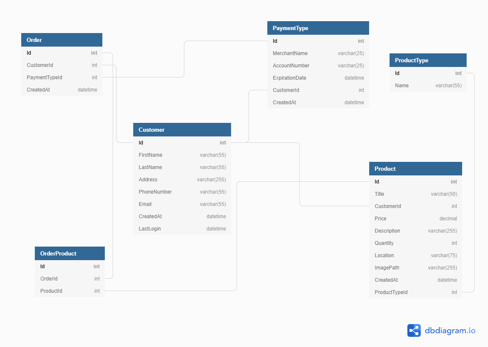

Bangazon eCommerce is a group project for [Nashville Software School C40](https://github.com/nss-day-cohort-40)

## Brief Proposal

A Marketplace application for users to buy and sell products online.  Users can register, list items to sell, or buy products that other users have to sell.

## Project Definition

* Front End is written in React.
* Users can create and account, login, and logout.
* Ability to list new products to sell, and remove any that have never sold.
* Add products to their shopping cart where they can review their order.
* Complete an order by selecting a payment type when Completing your order.
* Account Profile allows users to save different payment types as well as deleting them.
* Users can review their Order History.
* Users can view products listed for sale as well as search for products.
* Users can sort by product categories.

## Setup

Steps to get started:
1. `git clone git@github.com:nss-cohort-40/bangazon-ecommerce-client-lumberjacks-front.git`
1. `cd` into the directory it creates
1. `npm install` to build dependencies
1. `npm start` to run the app in the development mode
1. Open [http://localhost:3000](http://localhost:3000) to view it in the browser.

## Technologies Used

This project utilizes the following:
* This project was created with [Create React App](https://github.com/facebook/create-react-app).
* [React Router](https://reacttraining.com/react-router/) for page routing
* [React-bootstrap](https://react-bootstrap.github.io/) for menu, flexible formatting
* [Cloudinary](https://cloudinary.com/documentation) for picture storage

## Skills Utilized

We utilized all skills and concepts learned up to this point in our time here at NSS, including:

1. React: hooks, state, props, routes
1. API calls with: POST, PUT, DELETE, and GET
1. Javascript: functions, objects, arrays, mapping
1. Persistent data storage with a REST API
1. Github Scrum workflow
1. CSS styling

## Database Diagram

## Wireframe
[Bangazon Wireframe](https://sketchboard.me/rChsmNHwZwtu)